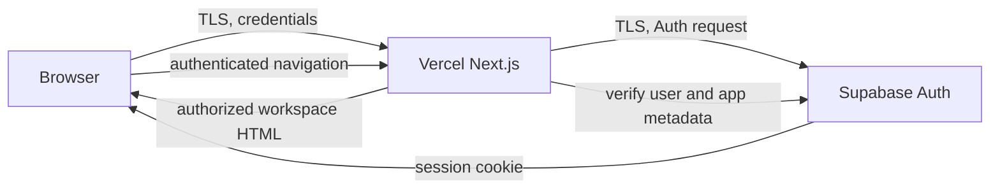

# Privacy Architecture

Audit date: 2026-08-15

## Current data flow

No private message, file, selfie, questionnaire response, ciphertext, key
envelope, Realtime payload, or application analytics event exists in this
release. Consequently there is no active encryption boundary or ten-minute
record lifecycle to claim. A future private-content feature must be separately
designed and tested before activation.

## Browser footprint

| Location | Current application data |
| --- | --- |
| Memory | Rendered neutral workspace and transient form values |
| localStorage | None |
| sessionStorage | None |
| IndexedDB | None |
| Cookies | Supabase Auth session cookies |
| CacheStorage | None |
| Service workers | None |

The auto-lock selection is memory-only and resets to five minutes on reload.
Locking signs out, removes the private DOM, and navigates with `location.replace`.
It does not destroy a cryptographic identity because none exists.

## Supabase footprint

| Service | Current use |
| --- | --- |
| Auth | Email/password sessions and trusted `app_metadata` authorization |
| Database | No application table access from current source |
| Realtime | None |
| Storage | None |

The audited live project is not a dedicated Broomer backend. It contains 106
Auth users, unrelated applications, 12 legacy Broomer questions, zero responses,
and a shared public bucket with 39 unrelated objects. No live destructive change
was made. The retirement migration removes only explicitly named Broomer legacy
objects and must be applied to the correct project after review.

## Vercel footprint

Vercel serves `/`, `/admin/login`, `/admin`, and `/admin/logout`. No private-data
API route or Server Action remains. The login Server Action sends credentials to
Supabase Auth through the server client. Application code contains no console
logging, analytics, monitoring SDK, or error-reporting SDK. Platform request and
security logs remain under provider retention controls.

## Network footprint

| Domain | Purpose | Required | Action |
| --- | --- | --- | --- |
| Application/Vercel domain | HTML and static application assets | Yes | Keep |
| Configured `*.supabase.co` project | Authentication and session verification | Yes | Keep; use a dedicated project |

GIPHY and all arbitrary remote media dependencies were removed. Runtime CSP
permits only same-origin and the configured Supabase HTTP/WebSocket origins.
The production-like public/sign-in capture observed 11 same-origin requests and
no external hostname. An authenticated capture was not possible because the
connected shared project has zero users carrying the required Broomer claim.

## Metadata retained

Supabase Auth and providers may retain account identifiers, email address,
authentication timestamps, session records, IP addresses, user-agent data, and
security/audit logs. Vercel and network providers may retain request time, route,
IP address, user agent, deployment identifiers, and operational logs. The app
does not add profiles, public usernames, contacts, presence, activity history,
filenames, device fingerprints, analytics IDs, or content records.

## Cryptography decision

The removed prototype used sound primitives (libsodium sealed boxes and
XChaCha20-Poly1305 with random nonces and authenticated routing metadata), but a
protocol is more than primitives. It hardcoded message version 1 while the SQL
could create later key versions, persisted raw private-key bytes in IndexedDB,
and lacked authenticated rotation completion, envelope-race handling, replay
rejection after deletion, crash recovery, and multi-tab coordination. Patching
one line would not make that protocol safe.

The safer change is a clean retirement: no encryption claim, no dormant schema,
no crypto dependency, and no plaintext fallback. Reintroduction requires an
established protocol/implementation, versioned migration, independent review,
and tests for two users, multiple devices/tabs, rotation, revocation, reload,
concurrency, replay, and recovery.

## Ten-minute expiration

No sensitive temporary records currently exist, so no expiration claim is made.
Any future temporary table must use a server-generated `expires_at`, RLS that
hides expired rows immediately, and server-side scheduled deletion independent
of browsers. Tests must cover offline users, closed browsers, refresh, delayed
cleanup, incorrect device clocks, and reconnect after expiry.

Application deletion means removal from active tables/object storage. It does
not guarantee immediate physical erasure from WAL, backups, PITR, provider logs,
replicas, or snapshots.

## Audit findings

| Severity | Component | Problem and effect | Resolution |
| --- | --- | --- | --- |
| HIGH | Public questionnaire/camera | Disguised public flow could capture and retain a selfie without explicit product consent | Entire feature, routes, storage helper, and media removed |
| HIGH | Legacy chat | “Private” content was plaintext and protected only by a permanent browser token | Chat routes/UI/schema removed; no fallback retained |
| HIGH | Live backend | Connected project is shared and has 106 users, not two | No destructive change; dedicated-project deployment requirement documented |
| HIGH | Retention | Questionnaire/chat content lacked complete server retention | Content features removed; no current temporary records |
| HIGH | E2EE prototype | Rotation/replay/concurrency protocol was incomplete | Prototype and claims removed pending clean protocol design |
| MEDIUM | Browser persistence | Chat token, GIPHY ID, and raw private key used persistent storage | All three persistence paths and dependencies removed |
| MEDIUM | Network | GIPHY API/media/analytics expanded browser disclosure | GIPHY removed; CSP reduced to app and Supabase |
| MEDIUM | Headers/cache | No explicit CSP or privacy/security headers | Global headers and automated tests added |
| MEDIUM | Errors/logs | Legacy routes returned raw backend errors | Routes removed; current app has no data API errors |
| MEDIUM | Auth configuration | Signup/provider/rate-limit settings cannot be proven from source | Deployment checklist requires dashboard hardening |
| LOW | Source maps | Public production maps were not explicit | Explicitly disabled |
| OK | Current permissions | No camera, notifications, PWA, WebRTC, geolocation, clipboard, or service worker | Enforced by source audit, CI scan, and Permissions-Policy |
| OK | Dependencies | `npm audit` reports zero vulnerabilities | Keep pinned lockfile; review major upgrades separately |

## Scores

| Area | Score | Evidence |
| --- | ---: | --- |
| Cryptographic architecture | 2/10 | No unsafe active crypto, but no E2EE feature exists |
| Authentication | 6/10 | Server-verified Supabase sessions; dashboard signup/MFA/rate limits unverified |
| Authorization/RLS | 6/10 | Server app-metadata gate; no current data tables; target backend mismatch unresolved |
| Database privacy | 7/10 | Current source stores no app content; legacy cleanup migration awaits correct target |
| Metadata minimization | 8/10 | Auth/session/provider metadata only in application design |
| Browser persistence | 9/10 | Auth cookies only; no app Web Storage/IndexedDB/CacheStorage |
| File privacy | 8/10 | File feature fully absent; no plaintext upload path |
| Network dependency minimization | 9/10 | Application/Vercel and Supabase only |
| Backend security | 6/10 | Minimal routes and headers; deployment Auth settings and dedicated backend pending |
| Overall privacy architecture | 7/10 | Small and defensible, but private-content functionality is intentionally unavailable |

## Automated controls

`npm run privacy-audit` fails CI on trackers, service workers, push,
permissions, WebRTC, console logging, browser persistence, exposed privileged
environment names, missing headers, and plaintext marker leakage. `npm run
plaintext-leak-test` checks built server/public artifacts. Security tests verify
headers and API no-store policy.

The repository marker scan is static because there is no private-content flow.
When encrypted content is reintroduced, the test must be expanded to a real
authenticated browser flow and inspect network bodies, Realtime payloads,
database rows, Web Storage, IndexedDB, CacheStorage, and application logs.

## Secret scan

No credential-shaped Supabase secret key, private key, or JWT value was found in
Git history. Two historical commits contain credential-bearing PostgreSQL URL
patterns. Their complete values are intentionally not reproduced: **ROTATION
REQUIRED** for any database password represented by those URLs unless the owner
can prove they were placeholders or have already been revoked. Ignored local
environment files contain current Vercel OIDC tokens; they were not committed.